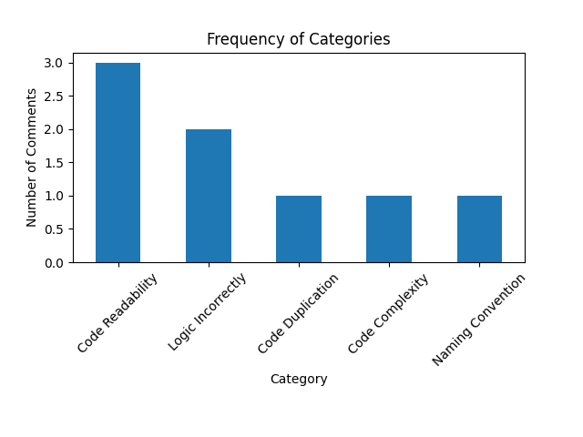
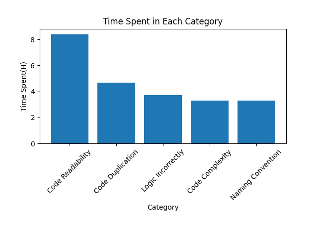

# comment-scrapper

## Description

This is a simple script to scrap comments from a PR from Azure DevOps.

This project tries to use ChatGPT to classify the PR comments into 5 categories:
 - Code Complexity
 - Naming Convention
 - Code Duplication
 - Code Readability
 - Logic Incorrectly

Along with that, we try to estimate how much time, in hours, was spent on each category.

The result are two bar charts, illustrated below:




## How to use it

First, install the requirements.txt file

Then:
```
python main.py -u {USERNAME} -p {PERSONAL_ACCESS_TOKEN} -pr {FULL_PR_LINK}
```
OBS: You can pass multiple `-pr parameters to the script.

## Notes

This is just a simple project from a developer who is learning Python. Don't take us to seriously :). 

Feel free to contribute to it.
